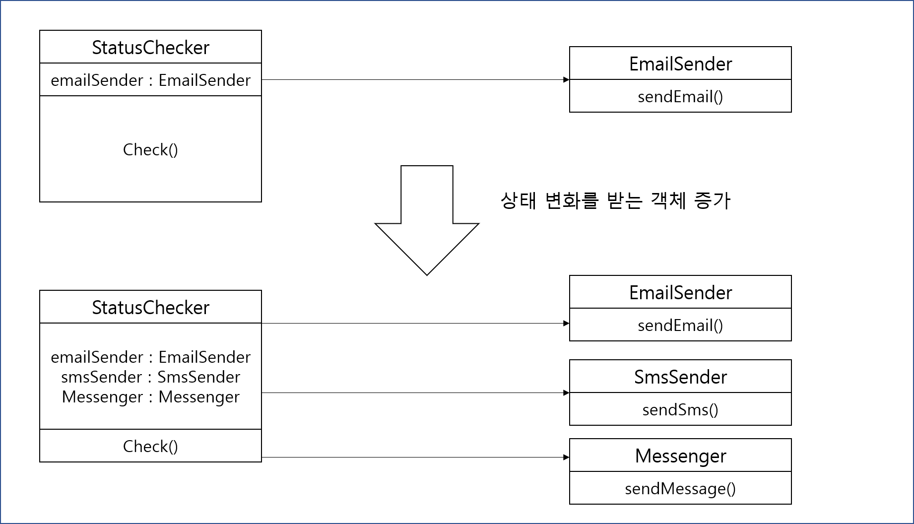

## 옵저버 패턴

- 웹 사이트의 상태를 확인해서 응답이 느리거나 연결이 안되면 모니터링 담당자에게 메일 통지

```java
public class StatusChecker {
	private EmailSender emailSender;
	
	public void check(){
		Status status = loadStatus();
		if(status.isNotNormal())
			emailSender.sendEmail(Status);
	}
}
```

- 이메일 뿐만 아니라 긴급한 메시지는 SMS로 바로 알려주는 기능 추가 

```java
public class StatusChecker{
	private EmailSender emailSender;
	private SmsSender smsSender;
	
	public void check(){
		Status status = loadStatus();
		if(status.isNotNormal()){
			emailSender.sendEmail(status);
			smsSender.sendSms(Status);
		}
	}
}
```




- StatusChecker는 상태가 불안정 해지면 Email,Sms,Messenger 객체에게 알려줌
  - 상태가 변경될 때 정해지지 않은 임의의 객체에 변경 사실을 통보
- 옵저버패턴은 상태가 정해지지 않은 여러 다른 객체에게 통지하고싶을 때 사용한다


- 주제 객체는 다음과 같은 책임을 가진다
  - 옵저버 목록을 관리, 등록,제거 메서드를 제공
  - 상태 변경이 발생되면 옵저버에 변경 내역을 알린다 (notifyStatus)


```java
public abstract class StatusSubject{
	private List<StatusObserver> observers = new ArratList<>();
	
    public void add(StatusObserver observer){
        observers.add(observer);
    }
    
    public void remove(StatusObserver observer){
        observers.remove(observer);
    }
    
    public void notifyStatus(Status status) {
        for(StatusObserver observer : observers)
            observer.onAbNormalStatus(status);
            
    }
}
```

```java
public class StatusChecker extends StatusSubject{
	public void check(){
		Status status = loadStatus();
		
		if(status.isNotNormal())
			super.notifyStatus(status);
	}
	
	private Status loadStatus(){
		...
	}
}
```

- 비정상 감지시 상위 클래스의 notifyStatus 메소드를 호출한다


### 옵저버 인터페이스 구현

```java
public interface StatusObserver {
	void onAbnormalStatus(Status status);
}
```


```java
public class StatusEmailSender implements StatusObserver {
	@Override
	public void onAbnormalStatus(Status status) {
		sendEmail(status);
	}
    
    public void sendEmail(Status status) {
        ...
    }

}
```


#### 옵저버 객체의 사용

- StatusChecker 객체가 옵저버 객체를 등록 해줘야 사용이 가능하다

```java
StatusChecker checker = new StatusChecker();
checker.add(new StatusEmailSender());
```

- 옵저버 패턴의 장점은 주제 클래스 변경 없이 옵저버를 추가할 수 있다.

#### 옵저버 객체에게 상태 전달

- 주제 객체의 상태를 필요로 하는 경우
  - 장애 상태인 경우 SMS, 응답속도가 느린 경우는 메세지 전달을 하지않도록 하는 경우
- 직접적으로 콘크리트 주제 클래스에 의존하게 되는경우

```java
public class SpecialStatusObserver implements StatusObserver {
	private StatusChecker statusChecker;
	private Siren siren;
	
	public SpecialStatusObserver(StatusChecker statusChecker){
		this.statusChecker = statuschecker
	}
	
	public void onAbnormalStatus(Status status){
		if(status.isFault() && statusChecker.isContinuousFault())
		siren.begin();
	}
}
```


### 옵저버에서 주제 객체 구분

- GUI 프로그래밍에서 옵저버 패턴을 가장 많이 사용
  - 버튼 : 주제 객체
  - 로그인모듈 호출 :  옵저버

```java
public class MyActivity extends Activity implements View.OnClickListener {
	public void onCreate(Bundle savedInstanceState) {
		super.onCreate(savedInstanceState);
		setContentView(R.layout.main);
		...
		Button loginButton = getViewById(R.id.main_loginbtn);
		loginButton.setOnClickListener(this);
	}
	
	@Override
	public void onClick(View v){
		login(id,password);
	}
}
```

- OnClickListener 인터페이스가 옵저버 인터페이스가 된다.
- 한 개의 옵저버 객체에 여러 주제 객체를 등록할 수도 있다.


```java
public class MyActivity extends Activity implements View.OnClickListener {
	public void onCreate(Bundle savedInstanceState) {
		super.onCreate(savedInstanceState);
		setContentView(R.layout.main);
		...
		Button loginButton = (Button) findViewById(R.id.main_loginbtn);
		loginButton.setOnClickListener(this);
		Button logoutButton = (Button) findViewById(R.id.main_loginbtn);
		logoutButton.setOnClickListener(this);
	}
	
	public void onClick(View v){
		if(v.getId() == R.id.main_loginbtn) {
			login(id,password);
		} else if( v.getID() == R.id.main_logoutbtn){
			logout();
		}
	}   
}		
```


### 옵저버 패턴 구현의 고려 사항

- 주제 객체의 통지기능 실행 주체
- 옵저버 인터페이스의 분리
- 통지 시점에서의 주제 객체 상태
- 옵저버 객체의 실행 제약 조건


##### 옵저버에 통지하는 시점을 결정하는 주체

```java
public class StatusChecker extends StatusSubejct{
	public void check(){
		Status status = loadStatus();
		
		if(status.isNotNormal()){
			super.notifyStatus(status); // Status Checker가 옵저버에 통지
		}
	}
}
```

- 여러 StatusChecker 객체로부터 상태정보를 읽어와 모두 비정상인 경우에만 통지

```java
StatusChecker status1 = ...;
StatusChecker status2 = ...;

checker1.check();
checker2.check();

if( checker1.isLastStatusFault() && checker2.isLastStatusFault()){
	checker1.notifyStatus();
	checker2.notifyStatus();
}
```

- 버튼처럼 주제 객체 상태가 바뀔 때마다 옵저버에 통지해줘야한다면?
  - 주제 객체에서 직접 통지 기능을 실행하는 것이 유리
    - 실수로 통지기능을 호출하지 않을 가능성을 유발
- 반대로 연속적인 상태 변경 이후 옵저버에게 통지해야한다면?
  - 주제 객체의 상태를 변경하는 코드에서 통지기능을 실행해주도록 하는 것이 수월


##### 옵저버 인터페이스 개수

- 상태 변경 내역의 종류가 다양한 경우(마우스 클릭 이벤트, 터치 이벤트, 드래그 이벤트 등)
  - 각 종류별로 옵저버 인터페이스를 분리해서 구현이 좋음
- 미분리 시 옵저버 인터페이스가 거대해질 수 있으며 콘크리트 클래스에서 불필요한 코드를 생성한다


##### 주제 객체의 상태에 결함이 없어야 한다

```java
public class AnySubejct extends SomeSubejct {
	@Override
	public void changeState(int newValue){
		super.changeState(newValue);// 상위 changeState에서 옵저버에 통지
		// 아래 코드가 실행되기 전에 옵저버가 상태를 조회
		if(isStateSome()){
			state += newValue;
		}
	}
}
```

- 옵저버 객체가 AnySubject의 상태를 코드 실행 전에 조회함으로 옵저버 객체는 완전하지 못한 상태를 조회


상태 변경과 통지기능에 템플릿 메서드 패턴을 적용하면 다음과 같은 문제를 해결한다

```java
public class SomeSubject {
	public void changeSate(int newState){
		internalChangeState(newState);
		notifyObserver();
	}
	
	protected void internalChangeState(int newState){
		...
	}
}
```

```java
public class AnySubject extends SomeSubject {
	// internalChangeState 메서드 실행 이후 옵저버에 통지
	@Override
	protected void internalChangeState(int newValue) {
		super.internalChangeState(newValue);
		if(isStateSome()){
			state += newValue;
		}
	}
}
```

- interChange 메서드에서 상태변화를 마무리 한 다음에 옵저버 객체가 상태 값을 접근


##### 옵저버 객체의 실행에 대한 제약규칙

```java
private void notifyToObserver(){
	for(StatusObserver o : observers) 
		o.onStatusChange();
}

public void changeState(int newState) {
	internalChangeState(newState);
	notifyToObserver();
}
```

- 실행 시 메서드 마다 십 분 이상의 실행시간이 발생된다면?
  - 다른 옵저버 실행까지 지연된다.
  - 옵저버 메서드에 대한 명확한 기준이 필요

