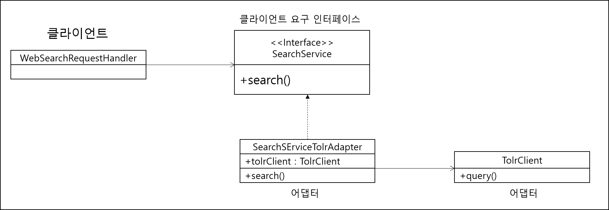

## Adapter 패턴

- 통합 검색 기능 구현시 인스터페이스와 재사용하려는 모듈 인터페이스가 동일하지 않을 때 사용하는 패턴



- Adapter 클래스는 SearchService 인터페이스에 맞춰주는 책임을 갖는다

```java
public class SearchServiceTolrAdapter implements SearchService{
	private TolrClient tolrClient = new TolrClient();
    
    public SearchResult search(String keyword){
        //keyword를 tolrClient가 요구하는 형식으로 변환
        TolrQuery tolrQuery = new TolrQuery(keyword);
        //TolrClient 기능 실행
        QueryResponse response = tolrClient.query(tolrQuery);
        //TolrClient 결과를 SearchResult로 변환
        SearchResult result = convertToResult(response);
        return result; 
    }
}
```

- 어댑터 패턴이 적용된 예가 SLF4J
  - log4j, LogBack 등 다양한 로깅 프레임워크를 사용할 수 있음


### 상속을 통한 어댑터 구현

```java
public class SearchServiceTolrAdapter extends TolrClient implements SearchService {
    public SearchResult search(String keyword){
        TolrQuery tolrQuery = new TolrQuery(keyword);
        QueryResponse response = super.query(tolrQuery);
        SearchResult result = convertToResult(respone);
        retunr result;
    }
}
```

