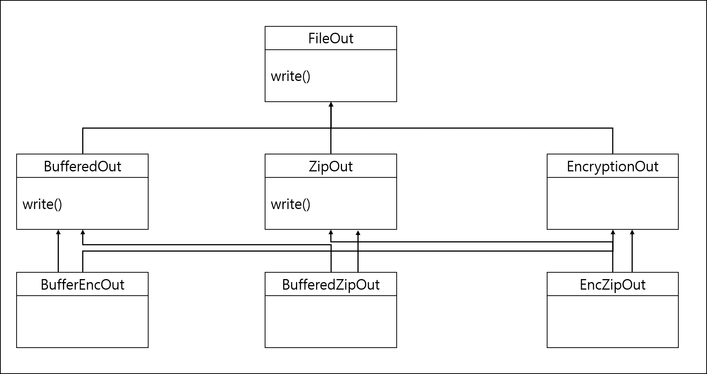
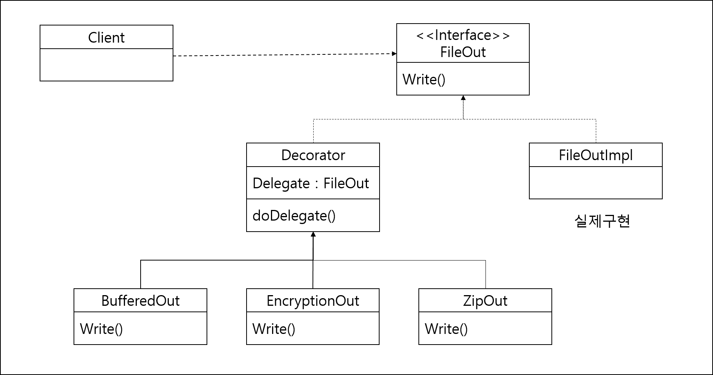

## Decorator 패턴

- 상속은 기능 확장하는 방법을 제공
  - 다양한 조합의 기능과 확장이 요구될 때 불필요한 클래스가 증가
  - 계층 구조가 복잡해짐

> AS-IS



> TO-BE



- FileOut 인터페이스는 출력 기능 정의
- 실제 파일 출력 기능은 FileOutImpl
- 기능 확장을 위해 Decorator 추상클래스 작성

````java
public abstract class Decorator implements FileOut {
	private FileOut delegate; //위임대상
	public Decorator(FileOut delegate){
		this.delegate = delegate;
	}
	
	protected void doDelegate(Byte[] data){
		delegate.write(data);
	}
}
````

- BufferedOut, EncryptionOut,ZipOut 모두 데코레이터 클래스로 Decorator 클래스를 상속받고 있다.

  ```java
  public class EncryptionOut extends Decorator {
  	public EncryptionOut(FileOut delegate) {
  		super(delegate);
  	}
  	
  	public void write(Byte[] data){
  		byte[] encryptedData = encrypt(data);
  		super.doDelegate(encrpytedData);
  	}
  }
  ```


> 다음과 같이 write 메소드를 실행한다.

```java
FileOut delegate = new FileOutImpl();
FileOut fileOut = new EncryptionOut(delegate);
fileOut.write(data)
```

