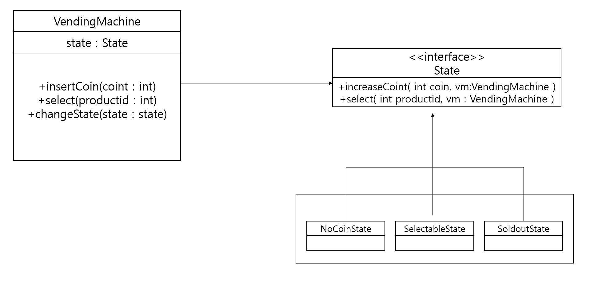

# State 패턴

- 단일 상품을판매하는 자판기

| 동작        | 조건                 | 실행                | 결과                                                 |
| ----------- | -------------------- | ------------------- | ---------------------------------------------------- |
| 동전을 넣음 | 동전 없음이면        | 금액을 증가         | 제품 선택 가능                                       |
| 동전을 넣음 | 제품을 선택 가능이면 | 금액을 증가         | 제품 선택 가능                                       |
| 제품 선택   | 동전 없음이면        | 아무 동작하지않음   | 동전 없음 유지                                       |
| 제품 선택   | 제품 선택 가능이면   | 제품 주고 잔액 감소 | 잔액 있으면 제품 선택 가능<br />잔액없으면 동전 없음 |


-  코드 예시

  ```java
  public static enum State { NOCOIN, SELECTABLE, SOLDOUT}
  	private State state = State.NOCOIN;
  	
  	public void insertCoin (int coin) {
  		switch(state) {
  			case NOCOIN:
  				increaseCoin(coin);
  				state = State.SELECTABLE;
  				break;
  				
  			case SELECTABLE:
  				increaseCoin(coin);
                  //추가 요청사항
              case SOLDOUT:
                  returnCoin();
  		}
  	}
  	
  	public void select(int productId) {
  		switch(state) {
  			case NOCOIN :
  				//아무것도하지않음
  				break;
  			case SELECTABLE :
  				provideProduct(productId);
  				decreaseCoin();
  				if(hasNoCoin())
  					state = State.NOCOIN;
                  //추가요청 사항
            case SOLDOUT:
                  //아무것도 하지 않음
  		}
  	}
  ```
  
  - 추가 요구 사항
    - 자판기에 제품이 없는 경우 동전을 넣으면 바로 동전을 되돌려준다.
  - 문제
  
    - 상태가 많아 질수록 조건문이 여러 코드에서 중복해서 출현
  
    - 새로운 상태를 추가하거나 기존 상태를 빼려면 모든 조건문을 찾아서 수정
      
  
-  조건문은 상태에 따라 동일한 기능 요청의 처리를 다르게 함

   -  상태를 별도 타입으로 분리하여 상태별로 알맞은 하위 타입을 구현
   -  상태 객체가 기능을 제공
   -  State 인터페이스는 동전 증가처리와 제품 선택 처리할 수 있는 두 개 메서드를 정의
      -  모든 상태에 동일하게 적용
   -  콘텍스트는 필드로 상태 객체를 갖고 있으며 클라이언트로부터 기능 실행 요청을 받으면 상태 객체에 처리를 위임한다.


- 상태 패턴에서 중요한 점은 상태 객체가 기능을 제공



- VendingMachine : 콘텍스트
- State : 상태
- 그 외 : 상태 콘크리트 클래스


### TO-BE

```java
public class VendingMachine{
	private State sate;
	
	public VendingMachine(){
		state = new NoCoinState();
	}
	
	public void insertCoint(int coin){
		state.increaseCoint(coin, this); // 상태 객체에 위임
	}
    
    public void select(int productId){
        state.select(productId, this);
    }
    
    public void changeState(State newState){
        this.State = newState;
    }
}
```

```java
public class NoConstate implements State{
	
    public void increaseCoint(int coin, VendingMachine vm){
        vm.increaseCoint(coin);
        vm.changeState(new SelectableState());
    }
    
    public void select(int productId, VendingMachine vm){
        SoundUtil.beep();
    }
}
```

- 상태별 처리코드를 분리하여 코드의 간결함과 변경의 유연함을 얻을 수 있음
- 장점
  - 새로운 상태가 추가되더라도 콘텍스트 코드가 받는 영향을 최소화
  - 동작을 구현한 코드가 상태별로 구분되어 상태별 동작을 수정하기 쉽다는 점


### 상태변경

- 상태 패턴의 고려할 문제는 상태 변경을 누가 하느냐
  - 주체는 콘텍스트 OR 상태 객체 둘 중 하나
    - 콘텍스트에서 상태 변경시
      - 상태 개수가 적고 변경규칙이 바뀌지 않을 때
    - 콘텍스트의 상태를 변경할 경우
      - 콘텍스트에 영향을 주지 않으면서 변경하고 싶을때
      - 대신 상태 변경 규칙이 분산되어 파악하기 어려움